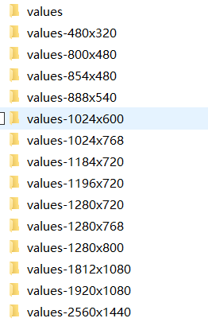
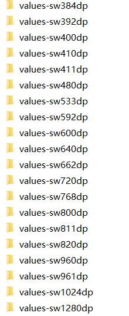

## UI适配

### Tip
1 dp解决了在大小差别不大的屏幕上，像素不一样时显示的‘绝对大小’一样的我问题。但不能解决在屏幕大小差距过大时，显示‘相对大小’一样的问题。
2 1in = 2.54cm = 160dp

### 布局适配
1 使用相对布局（RelativeLayout）

2 使用线性布局（LinearLayout）和wrap_content、match_parent、layout_weight

3 使用限定符来加载不同的屏幕

    1 尺寸限定符：
        
        例如：
            默认显示单面板布局：使用res/layout/main.xml
            7英寸屏幕显示双面板布局：使用res/layout-sw600dp/main.xml
        
    2 屏幕方向限定符（使用布局别名）：
            
        例如：
            默认显示布局:使用res/values/main_layout.xml
            
            <resources>
                <item name="main_layout" type="layout">@layout/onepanes</item>    
            </resources>
            
            7英寸屏幕竖向显示单面板布局：使用res/values-sw600dp-port/main_layout.xml
             <resources>
                  <item name="main_layout" type="layout">@layout/onepanes</item>    
             </resources>
             
             7英寸屏幕横向显示双面板布局：使用res/values-sw600dp-land/main_layout.xml
              <resources>
                   <item name="main_layout" type="layout">@layout/twopanes</item>    
              </resources>            
  
    
    
### px适配

以某一分辨率（一般为1920*1080分辨率，因为美工给的图一般都是这个分辨率的）为基准，按笔记生成所有分辨率对应的像素数的dimens文件。再将生成的demens文件，放到对应的values文件（例如values-1280*720,values-1280*768）下。

优点是几乎不用计算，根据美工标注的尺寸就可以开发。

缺点是使用的不是官方推荐的dp，当没有包含某个分辨率时，该分辨率的适配将会有问题。

### dp适配

和px适配一样，以某一屏幕宽为基准（现在主流屏幕为sw600dp），按比例计算生成其它屏幕宽度下的dimens文件。再将生成的demens文件，放到对应的values文件(例如values-sw533dp，values-sw640dp)下。

优点是：由字体sp的适配。dp的适配效果也好于px。
缺点去：需要根据美工的给的图，把px计算成dp。如果忘记提供默认的dimens文件，适配效果会很差。

### 图片适配

1 使用.9.png图片

2 每种分辨率都做一套图。但这会导致apk包过大，也增加类美工的工作量。由于Android加载图片时会根据像素对图片进行自动缩小处理，所以一般可以只提供一套图，例如目前最主流的分辨率：1920*1080(xxhdpi).

3 使用ImageView的ScaleType属性，设置为centerCrop适配效果还可以。

4 动态设置控件大小
    
    activity.getWindowManager().getDefaultDisplay().getWidth();
    activity.getWindowManager().getDefaultDisplay().getHeight();
    
    
### 全面屏适配

1 防止出现黑边

在AndroidManifest.xml中可做如下配置，ratio_float的值官方建议大于2.1,因为18.5/9 = 2.0555：

    <meta-data android:name="android.max_aspect" android:value="ratio_float"/>
    
如果没有上面的配置，android:resizeableActivity（是否支持多屏显示） 也为false，默认最大纵横比1.86，默认不支持全面屏。

如果应用的 android:resizeableActivity 已经设置为 true，就不必设置 Maximum Aspect Ratio 了

2 防止图片伸缩变形

   使用相对布局
   
   提供对应分辨率的图片（drawable-xxhdpi-2016*1080、drawable-long）

   使用颜色填充背景、.9.png图片

### 虚拟键适配
    
 设置虚拟键区样式
    
 在主题中添加以下设置项：
    
    <item name="android:navigationBarColor">要设置的颜色值</item>

  使用window.setNavigationBarColor(int color)
        
    建议1：如果页面含有复杂背景/纹理，建议设置为透明
    建议2：含「底部Tab」的页面，建议将虚拟键设置为「底部Tab」的颜色
    建议3：不含「底部Tab」的页面，建议使用背景颜色